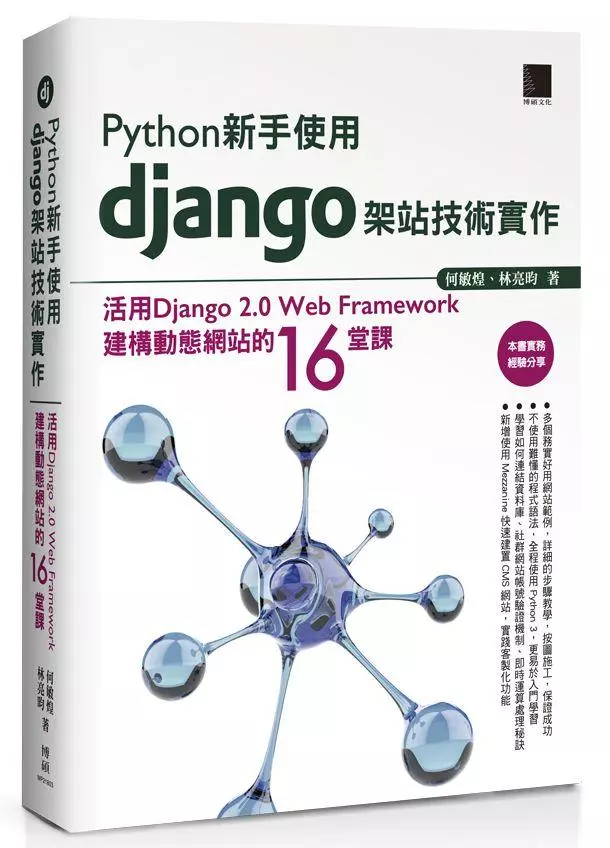

## Django Tutorial
### 簡介
本專案介紹 [Django](https://www.djangoproject.com) 網頁框架的安裝與使用方法，以 **部落格** 為例整合常見功能，包含幾個主要方向：

- 前端：網頁模版、網址設計、表單運用、Session 使用
- 後端：SQL 資料庫與模型、用戶登入功能
- 部署：本地端與虛擬主機架設

文章內容請參考以下章節：

1. [Django (一) 基本介紹與環境架設](https://ryanccj.github.io/blog/2021/DjangoI)
2. [Django (二) 模組功能與使用範例](https://ryanccj.github.io/blog/2021/DjangoII)
3. [Django (三) 網頁模版與網址設計](https://ryanccj.github.io/blog/2021/DjangoIII)
4. [Django (四) 資料庫與模型使用](https://ryanccj.github.io/blog/2021/DjangoIV)
5. [Django (五) 表單設計與整合](https://ryanccj.github.io/blog/2021/DjangoV)
6. [Django (六) 用戶登入與社群應用](https://ryanccj.github.io/blog/2021/DjangoVI)
7. [Django (七) 網站部署與內容管理](https://ryanccj.github.io/blog/2021/DjangoVII)

### 參考書目
本教學系列文主要參考「Python新手使用Django架站技術實作：活用Django 2.0 Web Framework建構動態網站的16堂課」(2018/07)，可至各大實體或網路通路選購。

